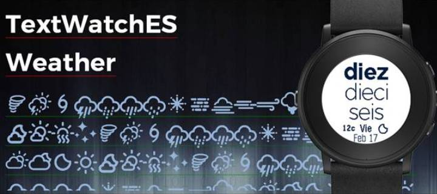

[Download it now!](https://apps.getpebble.com/en_US/application/58a7d8de6ca3876a5e00053b)
--------------------

For Time Round only
--------------------

Por fin en español! TextWatch ES + Weather displays the time in natural language (Spanish-Castilian) and allows you to check the weather condition and temperature (in C or F) on a glance. 

Based primarly on [DC TextWatch Deluxe](https://github.com/wackyneighbor/DC_Text_Watch_Deluxe) by [wackyneighbor](https://github.com/wackyneighbor) I evolved it to fit my own preferences:
  * Simple
  + Clean
  * Weather Added
  * Spanish only
  * Pebble Time Round only
  

Devs Help
--------------------
I am not planning on give continuity to this project, but if anyone would like to modify the code (translations and enhacements) I tagged the lines of the code that should be somehow modified with the tag TagDev. Summary of enhacements:

  * Supported in square Pebbles (Classic, Steel, Time Sq)
  * Translation for other languages
  * Improve the response from the Config (developed under Pebble Clay). Units updates after the main screen of the watch is restarted, not after saving settings.
  * Improve the customization: More weather providers (Yahoo based on this app)

Screenshots
------------

Attributions
--------------------
Fonts for Icons: [Weather Icons](https://erikflowers.github.io/weather-icons) by Eric Flowers, modified and fitted to regular alphabet, instead of Unicode values

License
--------

License [MIT](https://github.com/dieghernan/TextWatchES_Weather/blob/master/MIT%20License)
