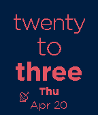
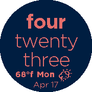

**TextWatch Clima** upgrades the classic TextWatch watchface adding a bunch of new capabilities. 

**Available for all the Classic, Time and Pebble 2 models**

#### [Download from Pebble Appstore](https://apps.getpebble.com/en_US/application/58a94da90dfc32d35b0002f8)

# Features
* Exact hour in natural language
* Autofit to screen
* Animation on text

## Take your pick
* Date format: Day Month / Month Day
* Language
  * Spanish
  * English
  * German (thanks to [rodher](https://github.com/rodher))
  * French
  * Italian
  * Portuguese
  * Norwegian
  * _More at request_
 * Weather: Current conditions on °c or °f.
 * Night theme displayed between sunset and sunrise
 * On Bluetooth disconnected displays 
 * On GPS requested but disconnected displays 
 * Choose your weather provider:
    * [Yahoo.com](https://www.yahoo.com/?ilc=401) _No API Key required (at this moment)_
    * [Wunderground](https://www.wunderground.com/?apiref=fb6856330e74c168)
    * [OpenWeatherMap](https://openweathermap.org/)
 * Implementation of [pmkey.xyz](https://www.pmkey.xyz)
 
 

# Attributions
## Fonts: 
 * [Weather Icons](https://erikflowers.github.io/weather-icons) by Eric Flowers, modified and fitted to regular alphabet, instead of Unicode values.
 * Custom font for icons created via [Fontastic](http://fontastic.me/).
 * [Gotham Fonts](http://fontsgeek.com/search?q=gotham) downloaded from [fontsgeek.com](http://fontsgeek.com)
  
## Weather providers  

[OpenWeatherMap.org](https://openweathermap.org/)

## Others

* [Master Key](https://www.pmkey.xyz) is a service for Pebble users. Get a unique PIN and add API Keys for your favorite online services. Please check [www.pmkey.xyz](https://www.pmkey.xyz) for more info.
* [wackyneighbor](https://github.com/wackyneighbor) project [DC TextWatch Deluxe](https://github.com/wackyneighbor/DC_Text_Watch_Deluxe)

# Screenshots
   

# License
Developed under license [MIT](https://github.com/dieghernan/TextWatchES_Weather/blob/master/MIT%20License).

#### Made in Madrid, Spain
