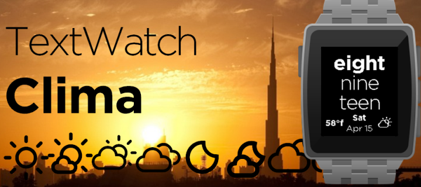

Introducing
------------

[Download it now!](https://apps.getpebble.com/en_US/application/58a94da90dfc32d35b0002f8)

All Classic and Time models supported
--------------------

Add some weather to your TextWatch! This watchface brings the weather conditions straight to your wrist. 

Based loosely on [DC TextWatch Deluxe](https://github.com/wackyneighbor/DC_Text_Watch_Deluxe) by [wackyneighbor](https://github.com/wackyneighbor), main features:
  * Simple
  * Clean
  * Weather Conditions and Temperature
  * Customizable
    * Multilingual: Spanish / English (more at request)
    * Temperature on Centigrades or Fahrenheit
    * Date format: DD MM / MM DD
  * Classic, Time and Pebble 2 models suported

Future Developments
--------------------

  * Translation to other languages
  * Improve the customization: More weather providers (Yahoo based on this app), etc.

Attributions
--------------------
Fonts in use: 
* [Weather Icons](https://erikflowers.github.io/weather-icons) by Eric Flowers, modified and fitted to regular alphabet, instead of Unicode values
* [Gotham Fonts](http://fontsgeek.com/search?q=gotham) downloaded from [fontsgeek.com](http://fontsgeek.com)

License
--------
License [MIT](https://github.com/dieghernan/TextWatchES_Weather/blob/master/MIT%20License)

Screenshots
----------

